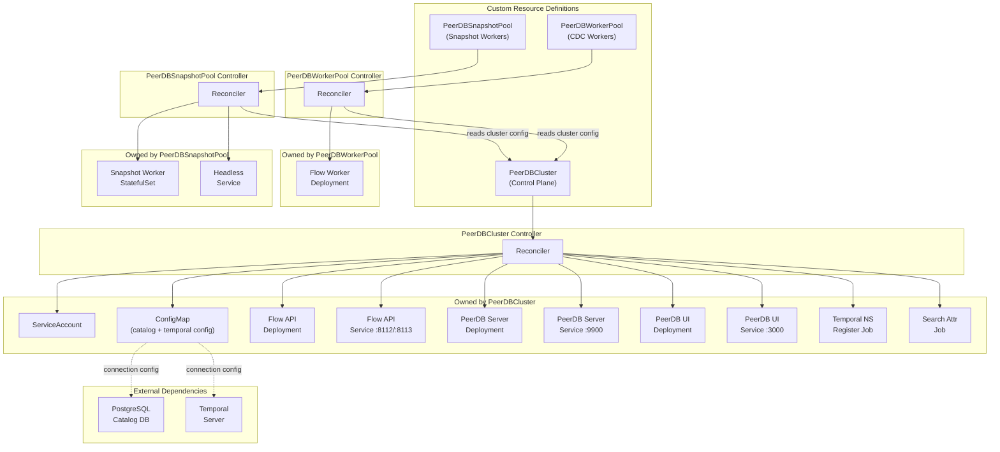

# PeerDB Operator

A Kubernetes operator for [PeerDB](https://github.com/PeerDB-io/peerdb) — a Postgres-first ETL/ELT platform for streaming data between databases. The operator automates deployment, scaling, and lifecycle management of PeerDB components on Kubernetes.

## Architecture

The operator uses a **multi-CRD design** (3 CRDs) that separates the control plane from independently-scalable worker pools. This allows CDC workers and snapshot workers to scale on their own schedules without affecting the core PeerDB services.



## Design Decisions

### Why 3 CRDs instead of 1?

PeerDB components have fundamentally different scaling characteristics:

| Component | Scaling Pattern | Resource Profile |
|-----------|----------------|-----------------|
| **Flow Workers** (CDC) | Scale horizontally based on CDC workload; CPU/memory heavy | 2 CPU, 8Gi RAM per replica |
| **Snapshot Workers** | Bursty — scale up during initial loads, scale to 0 when idle | 500m CPU, 1Gi RAM per replica |
| **Flow API / Server / UI** | Lightweight, steady traffic | 100m CPU, 128–256Mi RAM per replica |

A single CRD would force all scaling decisions through one reconciler and one spec, creating conflicts between HPA and the operator's replica management. The multi-CRD approach provides:

- **Independent scaling policies** — HPA/KEDA for workers without affecting the control plane
- **Multiple worker pools** — different sizing/placement per workload (e.g., IO-optimized nodes for heavy CDC)
- **Scale-to-zero** for snapshot workers with clear ownership and status
- **Separate RBAC** — teams can scale workers without permissions to change catalog credentials
- **Cleaner status reporting** — each CRD has focused conditions and metrics

### CRD Responsibilities

**`PeerDBCluster`** — The parent CRD representing a PeerDB installation:
- References external dependencies (PostgreSQL catalog, Temporal server)
- Manages shared infrastructure (ServiceAccount, ConfigMap with connection config)
- Deploys control plane components (Flow API, PeerDB Server, UI)
- Runs idempotent init jobs (Temporal namespace registration, search attributes)
- Reports overall cluster health via conditions (`Ready`, `CatalogReady`, `TemporalReady`, `Initialized`, `ComponentsReady`)

**`PeerDBWorkerPool`** — CDC Flow Worker Deployments:
- References a `PeerDBCluster` by name to inherit connection configuration
- Manages a Deployment with pod anti-affinity across zones
- Supports HPA via `autoscaling` spec (controller skips replica management when enabled)
- Allows multiple pools with different node selectors, tolerations, and resource profiles

**`PeerDBSnapshotPool`** — Snapshot Worker StatefulSets:
- References a `PeerDBCluster` by name
- Manages a StatefulSet with PersistentVolumeClaims for snapshot data
- Headless Service for StatefulSet DNS
- Long termination grace period (600s default) for in-progress snapshots
- Supports scale-to-zero when no initial loads are running

### Reconciliation Strategy

1. **Dependency validation** — Check catalog password Secret exists before proceeding
2. **Shared infrastructure** — ServiceAccount → ConfigMap (connection config)
3. **Init jobs** — Idempotent Temporal setup jobs; cluster waits for completion
4. **Components** — Flow API → PeerDB Server → UI (Deployments + Services)
5. **Status rollup** — Individual conditions aggregate into overall `Ready` condition

All managed resources have **OwnerReferences** set to the parent CR, enabling automatic garbage collection on deletion without custom finalizers.

### External Dependencies

The operator references external PostgreSQL and Temporal instances via connection configuration — it does **not** manage their lifecycle. This keeps the MVP scope bounded and avoids embedding complex database/workflow-engine management.

## Project Structure

```
api/v1alpha1/                    # CRD type definitions
├── peerdbcluster_types.go       # PeerDBCluster spec, status, conditions
├── peerdbworkerpool_types.go    # PeerDBWorkerPool spec, status, autoscaling
├── peerdbsnapshotpool_types.go  # PeerDBSnapshotPool spec, status, storage
└── groupversion_info.go         # GVK registration

internal/
├── controller/                  # Reconciliation logic
│   ├── peerdbcluster_controller.go
│   ├── peerdbworkerpool_controller.go
│   └── peerdbsnapshotpool_controller.go
└── resources/                   # Kubernetes object builders
    ├── labels.go                # Common label helpers
    ├── configmap.go             # Shared ConfigMap (catalog + temporal env)
    ├── service_account.go       # ServiceAccount builder
    ├── flow_api.go              # Flow API Deployment + Service
    ├── peerdb_server.go         # PeerDB Server Deployment + Service
    ├── ui.go                    # PeerDB UI Deployment + Service
    ├── flow_worker.go           # Flow Worker Deployment
    ├── snapshot_worker.go       # Snapshot Worker StatefulSet + headless Service
    └── init_jobs.go             # Temporal init Jobs

config/
├── crd/bases/                   # Generated CRD manifests
├── rbac/                        # Generated RBAC rules
└── samples/                     # Example CR manifests
```

## Documentation

| Document | Description |
|----------|-------------|
| [API Reference (v1alpha1)](docs/api-reference/v1alpha1.md) | Complete CRD field reference with defaults and examples |
| [Minimal Installation](docs/installation/minimal.md) | Quickstart guide with external Temporal + PostgreSQL |
| [Production Installation](docs/installation/production.md) | RBAC, TLS, network policies, monitoring, and HA setup |
| [Troubleshooting](docs/troubleshooting.md) | Conditions/Events → user actions mapping |
| **Runbooks** | |
| [Cluster Not Ready](docs/runbooks/cluster-not-ready.md) | Diagnosing and resolving `Ready=False` |
| [Init Jobs Failing](docs/runbooks/init-jobs-failing.md) | Temporal namespace/search attribute job failures |
| [Scaling Worker Pools](docs/runbooks/scaling-worker-pools.md) | Manual, HPA, KEDA, and multi-pool scaling |
| [Safe Upgrade](docs/runbooks/safe-upgrade.md) | Upgrade policies, maintenance windows, and rollback |
| [Backup Awareness](docs/runbooks/backup-awareness.md) | Backup fencing annotation and safe backup procedures |

## Getting Started

### Prerequisites
- go version v1.24.0+
- docker version 17.03+
- kubectl version v1.11.3+
- Access to a Kubernetes v1.11.3+ cluster
- External PostgreSQL instance (catalog database)
- External Temporal server

### To Deploy on the cluster
**Build and push your image to the location specified by `IMG`:**

```sh
make docker-build docker-push IMG=<some-registry>/peerdb-operator:tag
```

**NOTE:** This image ought to be published in the personal registry you specified.
And it is required to have access to pull the image from the working environment.
Make sure you have the proper permission to the registry if the above commands don’t work.

**Install the CRDs into the cluster:**

```sh
make install
```

**Deploy the Manager to the cluster with the image specified by `IMG`:**

```sh
make deploy IMG=<some-registry>/peerdb-operator:tag
```

> **NOTE**: If you encounter RBAC errors, you may need to grant yourself cluster-admin
privileges or be logged in as admin.

**Create instances of your solution**
You can apply the samples (examples) from the config/sample:

```sh
kubectl apply -k config/samples/
```

>**NOTE**: Ensure that the samples has default values to test it out.

### To Uninstall
**Delete the instances (CRs) from the cluster:**

```sh
kubectl delete -k config/samples/
```

**Delete the APIs(CRDs) from the cluster:**

```sh
make uninstall
```

**UnDeploy the controller from the cluster:**

```sh
make undeploy
```

## Project Distribution

Following the options to release and provide this solution to the users.

### By providing a bundle with all YAML files

1. Build the installer for the image built and published in the registry:

```sh
make build-installer IMG=<some-registry>/peerdb-operator:tag
```

**NOTE:** The makefile target mentioned above generates an 'install.yaml'
file in the dist directory. This file contains all the resources built
with Kustomize, which are necessary to install this project without its
dependencies.

2. Using the installer

Users can just run 'kubectl apply -f <URL for YAML BUNDLE>' to install
the project, i.e.:

```sh
kubectl apply -f https://raw.githubusercontent.com/<org>/peerdb-operator/<tag or branch>/dist/install.yaml
```

### By providing a Helm Chart

1. Build the chart using the optional helm plugin

```sh
kubebuilder edit --plugins=helm/v1-alpha
```

2. See that a chart was generated under 'dist/chart', and users
can obtain this solution from there.

**NOTE:** If you change the project, you need to update the Helm Chart
using the same command above to sync the latest changes. Furthermore,
if you create webhooks, you need to use the above command with
the '--force' flag and manually ensure that any custom configuration
previously added to 'dist/chart/values.yaml' or 'dist/chart/manager/manager.yaml'
is manually re-applied afterwards.

## Performance Tuning

The operator exposes several flags for tuning performance at scale.

### Namespace Scoping

By default the operator watches all namespaces. To restrict it to a single namespace (reduces API server load and memory):

```sh
--watch-namespace=peerdb-production
```

### Leader Election Tuning

When running multiple replicas for HA, tune the leader election timing to balance failover speed vs API server churn:

| Flag | Default | Description |
|------|---------|-------------|
| `--leader-elect` | `false` | Enable leader election |
| `--leader-elect-lease-duration` | `15s` | Time a non-leader waits before forcing a new election |
| `--leader-elect-renew-deadline` | `10s` | Time the leader retries before giving up |
| `--leader-elect-retry-period` | `2s` | Interval between election retries |

**Trade-off:** Shorter lease durations mean faster failover but more API server traffic. For most deployments, the defaults are appropriate. Increase `lease-duration` to 30–60s in large clusters with many controllers competing for API server bandwidth.

### Informer Resync Period

```sh
--sync-period=10h
```

Controls how often informers re-list all objects from the API server. The default (controller-runtime's 10 hours) is appropriate for most cases. Only reduce this if you suspect the operator is missing watch events due to etcd compaction or network issues.

### Workqueue Rate Limiting

Each controller has built-in rate limiting (not configurable via flags):

| Controller | Max Concurrent | Backoff | Global Limit |
|------------|---------------|---------|--------------|
| PeerDBCluster | 1 | 1s–60s exponential | 10 qps, burst 100 |
| PeerDBWorkerPool | 2 | 1s–60s exponential | 10 qps, burst 100 |
| PeerDBSnapshotPool | 2 | 1s–60s exponential | 10 qps, burst 100 |

The PeerDBCluster controller is limited to 1 concurrent reconcile since it manages shared resources. Worker and snapshot pool controllers allow 2 concurrent reconciles since different pools are independent.

### Status Update Optimization

All controllers compare status before and after reconciliation and only write to the API server when status actually changed. This eliminates redundant status updates on steady-state reconciles, significantly reducing API server load when managing many clusters/pools.

## Contributing

1. Fork the repository
2. Create a feature branch (`git checkout -b feature/my-feature`)
3. Run `make manifests generate` after modifying CRD types
4. Run `go build ./...` and `go vet ./...` to verify changes compile
5. Submit a pull request

Run `make help` for all available make targets. More information on operator development can be found in the [Kubebuilder Documentation](https://book.kubebuilder.io/introduction.html).

## License

Copyright 2026.

Licensed under the Apache License, Version 2.0 (the "License");
you may not use this file except in compliance with the License.
You may obtain a copy of the License at

    http://www.apache.org/licenses/LICENSE-2.0

Unless required by applicable law or agreed to in writing, software
distributed under the License is distributed on an "AS IS" BASIS,
WITHOUT WARRANTIES OR CONDITIONS OF ANY KIND, either express or implied.
See the License for the specific language governing permissions and
limitations under the License.

