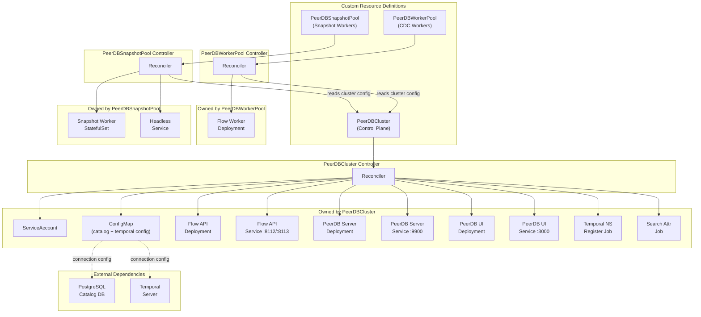

# Architecture

The operator uses a **multi-CRD design** (3 CRDs) that separates the control plane from independently-scalable worker pools. This allows CDC workers and snapshot workers to scale on their own schedules without affecting the core PeerDB services.



## Design Decisions

### Why 3 CRDs instead of 1?

PeerDB components have fundamentally different scaling characteristics:

| Component | Scaling Pattern | Resource Profile |
|-----------|----------------|-----------------|
| **Flow Workers** (CDC) | Scale horizontally based on CDC workload; CPU/memory heavy | 2 CPU, 8Gi RAM per replica |
| **Snapshot Workers** | Bursty — scale up during initial loads, scale to 0 when idle | 500m CPU, 1Gi RAM per replica |
| **Flow API / Server / UI** | Lightweight, steady traffic | 100m CPU, 128–256Mi RAM per replica |

A single CRD would force all scaling decisions through one reconciler and one spec, creating conflicts between HPA and the operator's replica management. The multi-CRD approach provides:

- **Independent scaling policies** — HPA/KEDA for workers without affecting the control plane
- **Multiple worker pools** — different sizing/placement per workload (e.g., IO-optimized nodes for heavy CDC)
- **Scale-to-zero** for snapshot workers with clear ownership and status
- **Separate RBAC** — teams can scale workers without permissions to change catalog credentials
- **Cleaner status reporting** — each CRD has focused conditions and metrics

### CRD Responsibilities

**`PeerDBCluster`** — The parent CRD representing a PeerDB installation:
- References external dependencies (PostgreSQL catalog, Temporal server)
- Manages shared infrastructure (ServiceAccount, ConfigMap with connection config)
- Deploys control plane components (Flow API, PeerDB Server, UI)
- Runs idempotent init jobs (Temporal namespace registration, search attributes)
- Reports overall cluster health via conditions (`Ready`, `CatalogReady`, `TemporalReady`, `Initialized`, `ComponentsReady`)

**`PeerDBWorkerPool`** — CDC Flow Worker Deployments:
- References a `PeerDBCluster` by name to inherit connection configuration
- Manages a Deployment with pod anti-affinity across zones
- Supports HPA via `autoscaling` spec (controller skips replica management when enabled)
- Allows multiple pools with different node selectors, tolerations, and resource profiles

**`PeerDBSnapshotPool`** — Snapshot Worker StatefulSets:
- References a `PeerDBCluster` by name
- Manages a StatefulSet with PersistentVolumeClaims for snapshot data
- Headless Service for StatefulSet DNS
- Long termination grace period (600s default) for in-progress snapshots
- Supports scale-to-zero when no initial loads are running

### Reconciliation Strategy

1. **Dependency validation** — Check catalog password Secret exists before proceeding
2. **Shared infrastructure** — ServiceAccount → ConfigMap (connection config)
3. **Init jobs** — Idempotent Temporal setup jobs; cluster waits for completion
4. **Components** — Flow API → PeerDB Server → UI (Deployments + Services)
5. **Status rollup** — Individual conditions aggregate into overall `Ready` condition

All managed resources have **OwnerReferences** set to the parent CR, enabling automatic garbage collection on deletion without custom finalizers.

### External Dependencies

The operator references external PostgreSQL and Temporal instances via connection configuration — it does **not** manage their lifecycle. This keeps the MVP scope bounded and avoids embedding complex database/workflow-engine management.

## Project Structure

```
api/v1alpha1/                    # CRD type definitions
├── peerdbcluster_types.go       # PeerDBCluster spec, status, conditions
├── peerdbworkerpool_types.go    # PeerDBWorkerPool spec, status, autoscaling
├── peerdbsnapshotpool_types.go  # PeerDBSnapshotPool spec, status, storage
└── groupversion_info.go         # GVK registration

internal/
├── controller/                  # Reconciliation logic
│   ├── peerdbcluster_controller.go
│   ├── peerdbworkerpool_controller.go
│   └── peerdbsnapshotpool_controller.go
└── resources/                   # Kubernetes object builders
    ├── labels.go                # Common label helpers
    ├── configmap.go             # Shared ConfigMap (catalog + temporal env)
    ├── service_account.go       # ServiceAccount builder
    ├── flow_api.go              # Flow API Deployment + Service
    ├── peerdb_server.go         # PeerDB Server Deployment + Service
    ├── ui.go                    # PeerDB UI Deployment + Service
    ├── flow_worker.go           # Flow Worker Deployment
    ├── snapshot_worker.go       # Snapshot Worker StatefulSet + headless Service
    └── init_jobs.go             # Temporal init Jobs

config/
├── crd/bases/                   # Generated CRD manifests
├── rbac/                        # Generated RBAC rules
└── samples/                     # Example CR manifests
```
